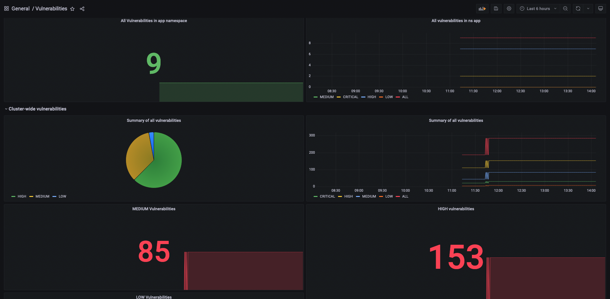
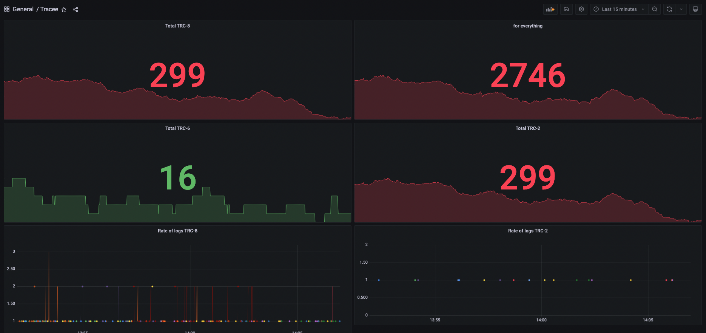

# Setting Up AlertManager with PrometheusRules to Forward Security Metrics to Slack.

This guide provides a comprehensive walkthrough for configuring Prometheus, Trivy-Operator, PrometheusRules, and AlertManager to monitor security metrics and deliver real-time alerts to Slack. By integrating these tools, you can proactively track vulnerabilities, policy violations, and other security events within your Kubernetes environment.

Introduction:

# Monitor your cluster security

# Prerequisites
- Helm CLI installed locally
- Kubectl installed locally
- A running Kubernetes cluster,  EKS Kubernetes cluster 

This repository uses the following applications:
- [Prometheus Stack Helm Chart](https://github.com/prometheus-community/helm-charts/tree/main/charts/kube-prometheus-stack)
- [Grafana](https://grafana.com/)
- [Promtail & Loki](https://grafana.com/oss/loki/)
- [Trivy Exporter](https://github.com/giantswarm/starboard-exporter)
- [Trivy Helm Chart](https://github.com/aquasecurity/trivy-operator)
- [Tracee](https://github.com/aquasecurity/tracee)

## Overview: AlertManager
AlertManager is bundled with the Prometheus Operator Helm Chart (kube-prometheus-stack). In this setup, Prometheus acts as the alert generator, while AlertManager functions as the alert receiver. Prometheus is configured to monitor specific alert conditions using PrometheusRules. When one of these rules is triggered, Prometheus forwards the alert to AlertManager, essentially saying, “This alert is firing — notify the appropriate users.”

The diagram below illustrates the relationship between Prometheus, PrometheusRules, and AlertManager.

Components highlighted in blue are installed automatically with the kube-prometheus-stack Helm Chart.

Components in yellow represent the custom PrometheusRules that must be added separately after the stack is deployed.


## Installing Prometheus 

Note: If you would like to install Prometheus with AlertManager, check out the example further below.

Create a monitoring namespace:
```
kubectl create ns monitoring
```

Install the helm prometheus stack chart:

```
helm repo add prometheus-community https://prometheus-community.github.io/helm-charts
```

```
helm repo update
```

```
helm upgrade --install prom prometheus-community/kube-prometheus-stack -n monitoring --values observability-conf/prom-values.yaml
```


Install promtail to collect logs from every node:

```
helm repo add grafana https://grafana.github.io/helm-charts
```

```
helm repo update
```

Install promtail

```
helm upgrade --install promtail grafana/promtail -f observability-conf/promtail-values.yaml -n monitoring
```

Install loki to collect all the logs from promtail:
```
helm upgrade --install loki grafana/loki-distributed -n monitoring
```

## Prometheus with AlertManager
AlertManager is automatically installed as part of the kube-prometheus-stack Helm Chart installation.
Before configuring alerts for our security metrics, we’ll deploy the Trivy Operator in the cluster. Trivy continuously scans for vulnerabilities and misconfigurations, generating the security-related metrics that Prometheus will monitor.

```
helm upgrade --install prom prometheus-community/kube-prometheus-stack -n monitoring --values observability-conf/prom-values-alertmanager.yaml
```


## Installing the Trivy Operator
The Trivy Operator integrates the Trivy security scanner into your Kubernetes cluster, enabling native, continuous security scanning of running resources such as Pods, Images, and Configurations.

Install Trivy operator:
```
helm repo add aqua https://aquasecurity.github.io/helm-charts/
```

```
helm repo update
```

And finally, the Helm chart can be installed with the following command:

```
helm upgrade --install trivy-operator aqua/trivy-operator \
  --namespace trivy-system \
  --create-namespace \
  --set="trivy.ignoreUnfixed=true" \
  --set="serviceMonitor.enabled=true" \
  --version 0.29.3
```


# Check if all pods are running


# Ensure that both Prometheus and Trivy Operator are installed correctly.


# Prometheus operator:


Before defining our alerting rules, it's important to first review the security metrics exposed by the Trivy Operator to understand what insights are available.


# kubectl port-forward service/trivy-operator 8080:8080 -n trivy-system

By port-forwarding the Prometheus service, we can easily access the Prometheus UI and run queries against specific metrics for quicker exploration and validation.

```
kubectl port-forward service/prom-kube-prometheus-stack-prometheus -n monitoring 9090:9090
```


## Triggering an Alert
Once you've configured a new Prometheus alert, it's a best practice to verify that it fires as expected.
To simulate a security-related alert, you can either delete the Trivy Operator Pod or deploy a container image containing CRITICAL vulnerabilities. For this example, we’ll use the latter approach.Before proceeding, create a demo namespace to avoid interfering with production or critical environments—because no one likes breaking things that matter!

```
kubectl create ns test
```
Next, create a Kubernetes Deployment within the test namespace. You can find the deployment manifest in my GitHub repository. This deployment launches a deliberately vulnerable React application containing 8+ CRITICAL vulnerabilities, ideal for testing security alerts in a controlled environment.


As soon as a new container starts running in the Kubernetes cluster, the Trivy Operator automatically generates a corresponding VulnerabilityReport for the container image. You can view these reports in the test namespace using the following command:

```
kubectl get VulnerabilityReport -n test
```


Additionally, any triggered alerts,such as those related to critical vulnerabilities,will be visible in AlertManager, where you can view, acknowledge, and manage them as needed.


## Tracee

Tracee can be added through the following instructions: https://aquasecurity.github.io/tracee/latest/tutorials/promtail/

## Open the dashboards in Grafana

You can then port-forward to grafana:
```
kubectl port-forward service/prom-grafana -n monitoring 3000:80
```

The login is:
    Username: admin
    Password: prom-operator

And provide Grafana with the dashboards in the [observability-conf](./observability-conf/) folder.
Note that Trivy also has a custom Dashboard -- [the ID: 17813 ]




